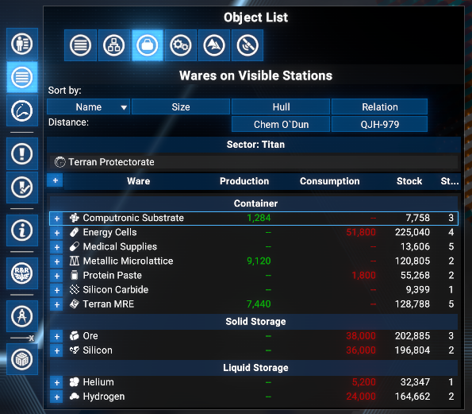
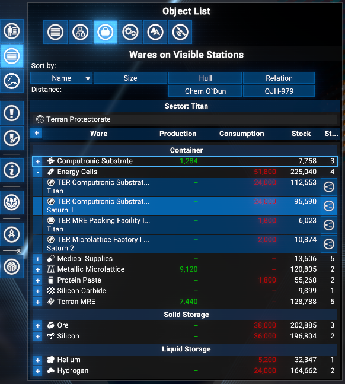
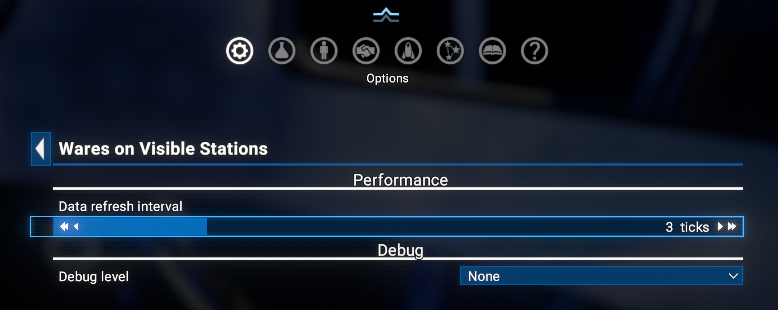

# Visible Ware Overview

Adds a **Wares on Visible Stations** tab to the **Object List** panel in the map. Lists all wares present at stations currently rendered in the map view, grouped by transport type (Container, Solid, Liquid, Condensate), with total stock, production and consumption per hour, and station count. Each ware row is expandable to a per-station breakdown.

## Features

- **Player and NPC stations**: Both player-owned and NPC stations are included. Player stations always show the full ware breakdown; NPC stations show ware details when the Logical Station Overview visibility rules allow it.
- **Grouped by transport type**: Wares are organised under section headers: Container Storage, Solid Storage, Liquid Storage, and Condensate Storage.
- **Per-ware summary row**: Each ware shows a ware icon with name, total production per hour (green), total consumption per hour (red), total stock across all visible stations, and the number of stations that handle it.
- **Expandable to per-station detail**: Click the `+` button on a ware row to expand it and see a sub-row for each station that handles that ware. The sub-row shows the station name with sector below, per-station production/h, consumption/h, and current stock.
- **Logical Station Overview button**: Each station sub-row has a button to open the Logical Station Overview for that station.
- **Expand/collapse all**: A button in the column header row expands or collapses all ware rows at once.
- **Empty state**: If no ware data is found for the visible stations, a clear message is shown.
- **Cached data**: Ware and station data are refreshed periodically to avoid redundant lookups every render.
- **Configurable refresh interval**: The data refresh interval (1-10 ticks, default 3) can be adjusted in **Extension options**.
- **Compatible with X4 8.00 and 9.00**.
- **Save-safe**: can be added or removed at any time without affecting saved games.

## Limitations

Because **Egosoft rejected** the proposal to expose a `C.GetMapRenderedSectors(holomap)` function for retrieving the list of sectors currently rendered on the map, this mod falls back to the vanilla approach and works only with stations visible on screen.
As a result, in most cases the data covers only a **limited number** of stations - significantly fewer than the total across all known sectors.

## Requirements

- **X4: Foundations**: Version **8.00HF4** or higher and **UI Extensions and HUD**: Version **v8.0.4.x** or higher by [kuertee](https://next.nexusmods.com/profile/kuertee?gameId=2659):
  - Available on Nexus Mods: [UI Extensions and HUD](https://www.nexusmods.com/x4foundations/mods/552)
- **X4: Foundations**: Version **9.00 beta 3** or higher and **UI Extensions and HUD**: Version **v9.0.0.0.8.4** or higher by [kuertee](https://next.nexusmods.com/profile/kuertee?gameId=2659).
- **Mod Support APIs**: Version 1.95 or higher by [SirNukes](https://next.nexusmods.com/profile/sirnukes?gameId=2659):
  - Available on Steam: [SirNukes Mod Support APIs](https://steamcommunity.com/sharedfiles/filedetails/?id=2042901274)
  - Available on Nexus Mods: [Mod Support APIs](https://www.nexusmods.com/x4foundations/mods/503)

## Installation

- **Steam Workshop**: [Visible Ware Overview](https://steamcommunity.com/sharedfiles/filedetails/?id=3721059680) - only for **Game version 8.00** with latest Steam version of the `UI Extensions and HUD` mod (version 80.43 from April 8).
- **Nexus Mods**: [Visible Ware Overview](https://www.nexusmods.com/x4foundations/mods/2102)

## Usage

Open the map and click the **Wares on Visible Stations** tab in the Object List panel tab strip. The tab is visible whenever you are on any map view.

All wares present at stations currently visible on the map are listed, grouped by transport type.

### Ware row

Each ware row contains:

- **+/-** expand button on the left to reveal per-station detail.
- Ware icon and name.
- Total production per hour (shown in green).
- Total consumption per hour (shown in red).
- Total stock across all visible stations handling this ware.
- Number of visible stations handling this ware.

### Station sub-row

Click `+` on a ware row to expand it. Each station that handles the ware gets a sub-row:

- Station name with sector shown below it.
- Per-station production per hour (green) and consumption per hour (red).
- Current stock at that station.
- **Logical Station Overview** button to open the station inventory and build plan.

### Column headers and expand/collapse all

The **+/-** button in the column header row expands or collapses all ware rows simultaneously.

### Extension options

**Options Menu > Extension options > Visible Ware Overview**:

- **Data refresh interval** (1-10, default 3): Number of UI ticks between data refreshes. Lower values keep ware data more up to date; higher values reduce CPU usage.
- **Debug level**: Sets the verbosity of debug logging (None / Debug / Trace). Intended for troubleshooting.

## Credits

- **Author**: Chem O`Dun, on [Nexus Mods](https://next.nexusmods.com/profile/ChemODun/mods?gameId=2659) and [Steam Workshop](https://steamcommunity.com/id/chemodun/myworkshopfiles/?appid=392160)
- *"X4: Foundations"* is a trademark of [Egosoft](https://www.egosoft.com).

## Acknowledgements

- [EGOSOFT](https://www.egosoft.com) - for the X series.
- [kuertee](https://next.nexusmods.com/profile/kuertee?gameId=2659) - for the `UI Extensions and HUD` that makes this extension possible.
- [SirNukes](https://next.nexusmods.com/profile/sirnukes?gameId=2659) - for the `Mod Support APIs` that power the UI hooks and options menu.

## Changelog

### [8.00.01] - 2026-05-05

- **Added**
  - Initial public version.
